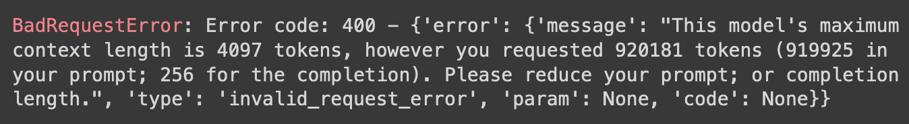

# flex[prompt]

Large language models have *maximum context window*—a maximum number of tokens they can receive and produce. You may have noticed this:

Flex prompt addresses this by fitting your prompt into the model's context window. You provide a flexible prompt template, flex prompt renders it into model input.

Flex prompt does not handle model execution, but integrates well with execution frameworks like LangChain and Haystack.

Check out the [intro to flex prompt colab](https://colab.research.google.com/github/queerviolet/flex-prompt/blob/main/doc/intro_to_flex_prompt.ipynb) ([github link](./doc/intro_to_flex_prompt.ipynb)) for usage and examples.
